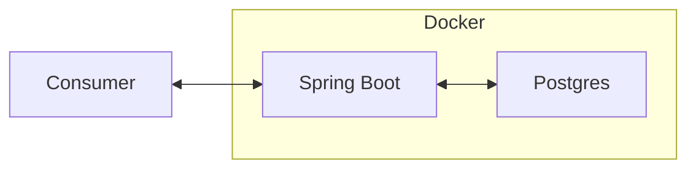

# Docker + Postgres + Spring Boot



## Run the stack

```
docker compose up -d --build
```

## Run the API in development mode

```
cd api
mvn clean package -DskipTests
docker compose up -d postgres
mvn spring-boot:run
```
